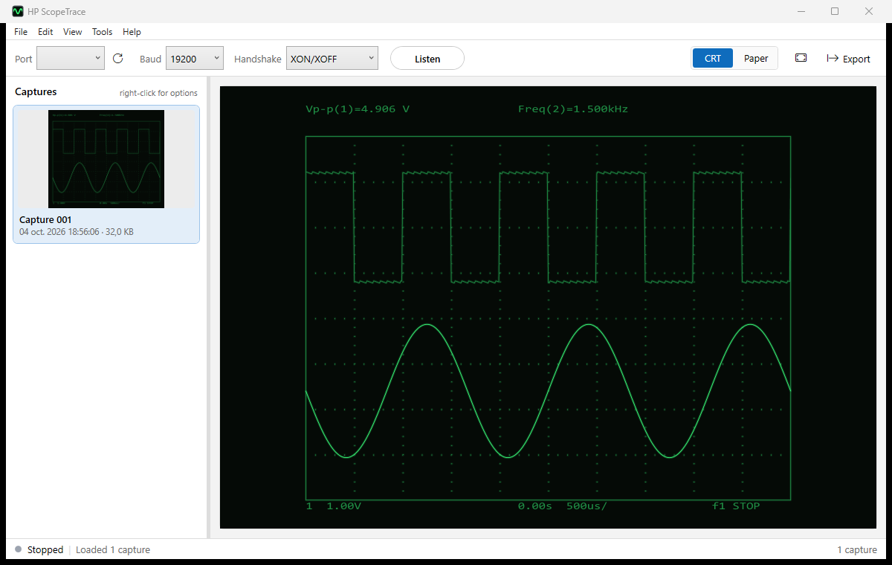

# ScopeTrace

Windows app that receives screen plots from an HP 54600 series oscilloscope over RS-232 and draws them as they come in.

The scope prints its screen as HP-GL (plotter language) when the hardcopy format is set to *Plotter*. ScopeTrace listens on a serial port, draws each plot live, and keeps every capture in a list so you can export them later. No need to touch the PC: each time you press Print Screen on the scope, a new capture shows up.



## Features

- Live drawing while the plot is being received
- Every Print Screen becomes its own capture, even if the scope pauses mid-transfer
- 1200 / 2400 / 9600 / 19200 baud, XON/XOFF or DTR handshake
- Two looks: green CRT (default) or gray on white paper
- Right-click menu on captures: export, copy, rename, rotate, delete, select all
- Export as PNG, SVG (vector) or the original HP-GL file, byte for byte
- Captures are kept between sessions (`%LOCALAPPDATA%\ScopeTrace`)

## Download

Grab `ScopeTrace.exe` from the [releases page](../../releases). It's a single portable exe, nothing to install. Needs 64-bit Windows 10 or 11.

The exe isn't code signed yet, so Windows SmartScreen may complain the first time. Click *More info* then *Run anyway*.

## Scope setup

Tested with a 54600B and an RS-232 interface module.

1. **Print/Utility → Hardcopy Menu → Format**: set it to **Plotter**.
2. **Print/Utility → I/O Menu**: pick a baud rate and handshake (XON is the safest).
3. In ScopeTrace, select the COM port, the same baud rate and handshake, and press **Listen**.
4. Press **Print Screen** on the scope.

Use a null-modem cable or adapter between the scope and the PC.

If a capture shows up sideways, use *Rotate* in the right-click menu.

## Building

Needs the .NET 8 SDK.

```
dotnet build
dotnet test
dotnet run --project src/ScopeTrace
```

Portable exe:

```
dotnet publish src/ScopeTrace -c Release -r win-x64 --self-contained -p:PublishSingleFile=true -o publish
```

*Tools → Replay HP-GL file* plays a `.plt` file at the selected baud rate as if the scope was sending it. `samples/54600_sample.plt` is a test plot you can use without a scope.

## License

MIT, see [LICENSE](LICENSE). Third-party components are listed in [THIRD-PARTY-NOTICES.md](THIRD-PARTY-NOTICES.md).
